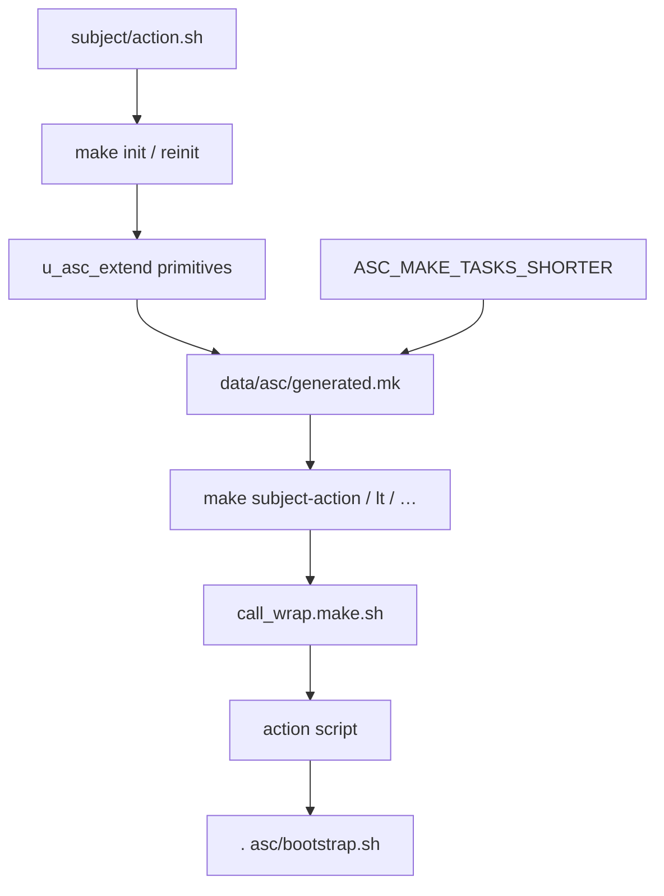

# Actions and Make

An **action** is a script `asc/<subject>/<action>.sh` (or under an extension / `scripts/asc/extend/`). `make init` / `reinit` discovers them and generates `data/asc/generated.mk` shortcuts (`subject-action`, with shorter aliases from `ASC_MAKE_TASKS_SHORTER`).



```bash
make list-actions
make make-list-entry-points
```

Always run from `$PROJECT_DOCROOT`. Prefer `make <entry>`; the equivalent path is the script itself after `. asc/bootstrap.sh`.

## Discovery rules

- **Folders** = subjects; **files** = actions (`*.sh`).
- Exceptions: dirs starting with `.`; files with double extensions (`*.inc.sh`) or starting with `.`; `.asc_actions_ignore` / `.asc_subjects_ignore`.
- Lookup: `./asc`, every **enabled** extension under `asc/extensions`, and `scripts/asc/extend`.
- Details: `u_asc_extend()` in `asc/utilities/asc.sh`.

## Hardcoded vs generated

| Source | Targets |
|--------|---------|
| [`asc/make/default.mk`](../../asc/make/default.mk) | `init`, `init-debug`, `setup`, `hook`, `hook-debug`, `globals-lp`, `debug` |
| `data/asc/generated.mk` (after init) | All discovered subject/action shortcuts + per-case test targets |

`.DEFAULT_GOAL` in the root [`Makefile`](../../Makefile) is `init`. The Makefile also `-include`s `.env`, `data/asc/generated.mk`, optional `ASC_MAKE_INC`, and `scripts/asc/extend/custom.mk`.

The `instance` subject is omitted from many make names (`make start` ≡ `instance start`). Shortening uses `ASC_MAKE_TASKS_SHORTER` (bash `${task//search/replace}` in `u_make_task_name()`).

Canonical short aliases:

| Shortcut | Full make target |
|----------|------------------|
| `lt` | `logged-thread` |
| `lc` | `logged-chain` |
| `ls` | `logged-sequence` |
| `lb` | `logged-batch` |
| `lp` | `logged-pipe` |
| `ll` | `logged-loop` |
| `reg` | `registry` |
| `pl` | `lookup-path` (must **not** collide with `lp`) |

Historical: `make globals-lp` remains a **hardcoded** target — not the `lp` → `logged-pipe` alias.

After changing `ASC_MAKE_TASKS_SHORTER` or adding actions: `make reinit`.

## Core subjects (examples)

| Subject | Example entry points |
|---------|----------------------|
| `instance` | `init`, `reinit`, `setup`, `start`/`stop`, `chain`, logged wrappers, `reg-*`, `switch-stack-version` |
| `host` | `host-provision`, `host-reg-*`, `host-vitals` |
| `git` | `git-write-hooks`, `git-find-changed-files` |
| `log` / `loop` / `thread` | wraps, status, batch/pipe/sequence |
| `test` | `test-asc`, `test-asc-*` |
| `sidecar` | `sidecar-wrap` |

Launch layering: [layers.md](layers.md). Observability paths: [observability.md](observability.md).
