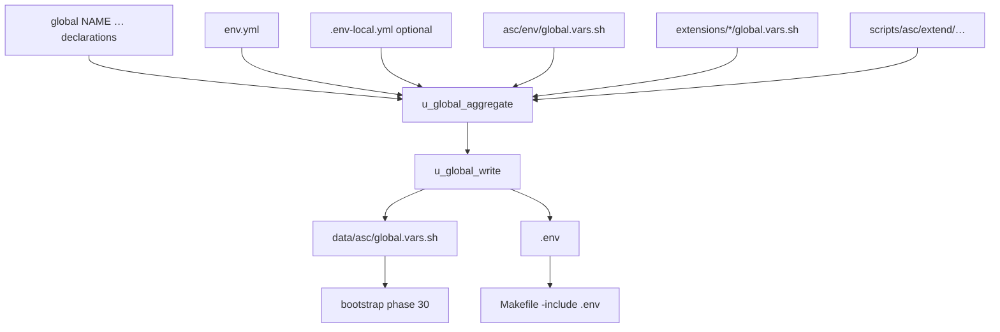

# Globals

**Layer 2** of the five ASC differentiators (see [layers.md](layers.md)): env-facing values that are either **readonly globals** or **calling-scope (“mutable”) vars**.

## Two kinds

| Kind | Mutability | Written by | Typical use |
|------|------------|------------|-------------|
| **Readonly globals** | `readonly` after write | `u_global_write` → `data/asc/global.vars.sh` + `.env` | Instance constants shared by every bootstrap |
| **Calling-scope (“mutable”) vars** | Ordinary shell vars (not `readonly`) | Loaders / hooks mid-run (`u_db_set`, `u_remote_instance_load`, …) | Same abstract names, different target in one script |

Do **not** treat every env-looking name as a global. Mutables live in the process; durable codegen under `data/asc/` (e.g. remote instance exports) is Layer-1 data until loaded into scope.

---

## Readonly globals

Declared with `global NAME "…"`, or via YAML that flattens to the same name. Aggregated on `make init` / `reinit`, written **readonly** to gitignored `data/asc/global.vars.sh` (+ `.env`).

Bootstrap loads that file every run (phase 30). After changing a declaration: run `make reinit` so the written files regenerate.



### Declaration sources (lookup)

Order is built by `u_global_aggregate` / `make globals-lp` (core declarations, enabled extensions, project YAML, extend). List paths:

```bash
make globals-lp
# Or: asc/env/global_lookup_paths.make.sh
```

YAML in `env.yml` / `.env-local.yml` takes effect during aggregation (loaded late). For private overrides that must not be committed, use `.env-local.yml`.

### YAML flatten → same global name

These all yield `MY_CONSTANT_VALUE='the value'`:

```sh
global MY_CONSTANT_VALUE "the value"
```

```yaml
my:
  constant:
    value: the value
```

```yaml
my_constant_value: the value
```

Constant with no prompt (when `-y` is not set): provide the value in the `global` call. Prompt-only: `global MUST_INPUT_ON_INIT` with no default.

Stack values with `[append]=`:

```sh
global VALUES_WILL_CONCAT "[append]=path/to/file-1.txt"
global VALUES_WILL_CONCAT "[append]=path/to/file-2.txt"
```

### Core defaults (selected)

See `asc/env/global.vars.sh` for the full set. Notable defaults:

| Global | Default |
|--------|---------|
| `PROJECT_DOCROOT` | `$PWD` |
| `STACK_VERSION` | `v1` |
| `INSTANCE_TYPE` | `dev` |
| `PROVISION_USING` | `asc` |
| `HOST_TYPE` | `local` |
| `ASC_APPS` | `site` |
| `ASC_TEST_CASE_CACHE` | `data/asc/cache/test-cases.sh` |

`make setup` may pass different CLI defaults (e.g. `PROVISION_USING=compose` as param 4) — see [README](../../README.md#usage--getting-started).

### Ops

```bash
make globals-lp
make init   # or make reinit
```

SoT: `asc/utilities/global.sh`, `asc/env/global.vars.sh`, specimen [`SPECIMEN.env.yml`](../../SPECIMEN.env.yml) → rename to `env.yml`.

---

## Calling-scope (“mutable”) vars

Simple shell variables — **not** `readonly`. Used when values must change mid-script (classic: DB helpers reuse `DB_*` names for different databases; remotes export `REMOTE_INSTANCE_*` for the loaded id).

These are **not** written by `u_global_write`. Do not put mid-run retargeting into readonly globals.
