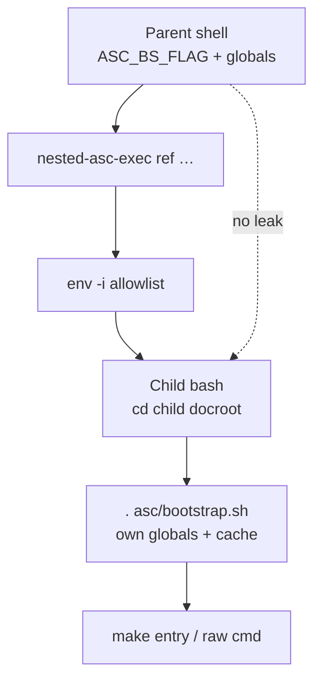

# Nested ASC

Optional extension `nested_asc` for listing nested ASC project instances and running commands in a **virgin env** inside them. Core-ignored by default — remove `nested_asc` from `.asc_extensions_ignore` to enable.



| Action | Path | Make |
|--------|------|------|
| List / map layouts | `asc/extensions/nested_asc/nested_asc/list.sh` | `make nested-asc-list [ref]` |
| Virgin-env exec | `asc/extensions/nested_asc/nested_asc/exec.sh` | `make nested-asc-exec <ref> e:<entry>` |

`ref` is a short id from the instance folder name. On name collisions, qualify with parent folders. Absolute paths still work.

| Form after `<ref>` | Behavior |
|--------------------|----------|
| `<make-entry>` / `e:<make-entry>` | Nested `make <entry> …` (`e:` when calling via `make`) |
| Path-like (`/`, `./`, `../`, ends `.sh`, …) | Raw in child — no make wrap |
| `-- <cmd…>` | Explicit raw command |

```bash
make nested-asc-list
make nested-asc-exec <ref> e:reinit
make nested-asc-exec <ref> -- git status
```

Shared helpers: `nested_asc.opt-inc.sh` (lazy via bootstrap phase 90). Prefer nested exec over sourcing another instance’s `global.vars.sh` in the parent shell.

Related recursion elsewhere (bounded):

- Hook variant subsequences — `u_str_subsequences` ([hooks.md](hooks.md))
- Token replacement — `u_str_convert_tokens` (max depth guard)

SoT: `asc/extensions/nested_asc/`, [`asc/extensions/README.md`](../../asc/extensions/README.md).
