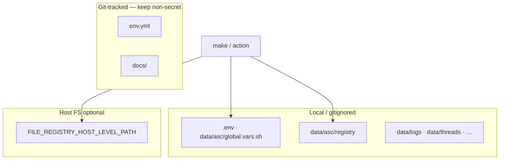

# Secrets

## Stance

ASC does **not** ship a vault. Secrets are filesystem-scoped, gitignored where possible, and passed through shell/env only when needed. Prefer local generation + registry over committing values.



## Where secrets typically live

| Store | Path / API | Typical content | Tracked? |
|-------|------------|-----------------|----------|
| **Globals write** | `.env`, `data/asc/global.vars.sh` | instance env (may include sensitive overrides) | **No** |
| **Instance registry** | `make reg-*` → `data/asc/registry/` (file_registry) | generated passwords, opaque KV | **No** |
| **Host registry** | `make host-reg-*` → host path from globals | cross-project host secrets | outside project git |
| **Logs / threads** | `data/logs/`, `data/threads/` | may echo secrets if a script prints them | ignored |

Tracked config that must stay non-secret: `env.yml` (structure, stack version, apps — not passwords).

## Registry as secrets store

When DB extensions are enabled, generated passwords often go through:

```bash
u_instance_registry_get "${db_id}.DB_PASS"
u_instance_registry_set "${db_id}.DB_PASS" "$DB_PASS"
```

Default backend: **file_registry** — plain files, **no encryption**. Fine for local/dev; not a production secret manager. Optional `git_crypt` extension is planned/stubbed for syncable-yet-opaque Layer-1 YAML (core-ignored by default).

```bash
make reg-set my_service.API_TOKEN '…'
make reg-get my_service.API_TOKEN
```

## Practical access control

- Same user that runs `make` can read instance registry and `.env`.
- Do not put passwords in tracked `env.yml`, README, or `docs/`.
- Do not commit `data/asc/`, `.env`, or private keys.
- Nested ASC (`nested-asc-exec`) uses `env -i` — parent secrets do not leak; child has its own `.env` / registry. See [nested-asc.md](nested-asc.md).

## Checklist

1. New secret → registry or gitignored local file, never tracked `env.yml`.
2. Script that needs it → read at runtime (`reg-get` / env), do not hardcode.
3. Before `git add` → confirm path is ignored.

See also: [globals.md](globals.md), [layers.md](layers.md).
