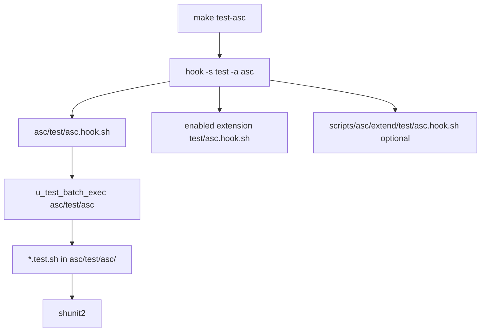

# Testing

## Entry point

```bash
make test-asc
# Or:
asc/test/asc.sh
```

Triggers:

```sh
hook -s 'test' -a 'asc' -v 'HOST_TYPE PROVISION_USING'
```

(Exact `-v` list may include `HOST_OS` depending on the caller; debug with `make hook-debug s:test a:asc v:HOST_TYPE PROVISION_USING`.)



Framework: vendored **shunit2** under `asc/vendor/shunit2`. Helpers: `asc/test/test.inc.sh`. There is **no** separate `make self-test` shortcut.

## What gets executed

1. **Core batch** — `asc/test/asc.hook.sh` → `u_test_batch_exec 'asc/test/asc'`
2. **Enabled extensions** — e.g. `asc/extensions/mysql/test/asc.hook.sh`, `compose/test/asc.hook.sh`, `pgsql/…` when those extensions are enabled
3. **Project extend** — optional `scripts/asc/extend/test/asc.hook.sh`

## Core cases (also individual make targets)

After `make reinit`, per-case shortcuts are generated into `data/asc/generated.mk` and registered in `data/asc/cache/test-cases.sh` (`ASC_TEST_CASE_CACHE`).

| Make target | Script |
|-------------|--------|
| `test-asc-bootstrap` | `asc/test/asc/bootstrap.test.sh` |
| `test-asc-global` | `global.test.sh` |
| `test-asc-hook` | `hook.test.sh` |
| `test-asc-utilities` | `utilities.test.sh` |
| `test-asc-fsop` | `fsop.test.sh` |
| `test-asc-wrap` | `wrap.test.sh` |
| `test-asc-logged-wrappers` | `logged_wrappers.test.sh` |
| `test-asc-required-programs` | `required_programs.test.sh` |
| `test-asc-test-results` | `test_results.test.sh` |

`asc/test/case.run.sh` is the shared **runtime dispatcher** for per-case targets only (not used by the full `test-asc` hook batch).

## Discovery layouts

`u_test_discover_batch_cases()` looks for a sibling directory named like the batch script without `.sh`:

1. **Flat** — `*.test.sh` in the batch directory
2. **Env subdirs** — `local/`, `preprod/`, `recette/`, `prod/` (`ASC_TEST_CASE_ENVS`)
3. **Manifest** — `.test-cases` listing case stems

## Results archiving

When `ASC_TEST_RESULTS` is not `0` (default: enabled), runs can archive under `${ASC_TEST_RESULTS_ROOT:-data/test-results}`.

## Contributing

1. Add `{extension}/test/asc.hook.sh` calling `u_test_batch_exec` on a sibling batch dir.
2. Place `*.test.sh` files there.
3. Optionally add a batch action script for a dedicated `make test-<name>` target.
4. `make reinit` then `make test-asc`.

SoT: `asc/test/asc.sh`, `asc/test/asc.hook.sh`, `asc/test/test.inc.sh`, `asc/make/make.inc.sh`.
