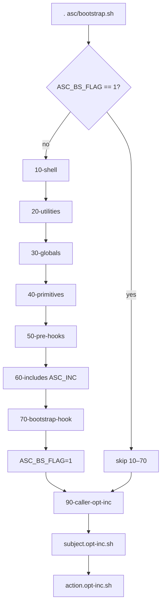

# Bootstrap

Every ASC action starts with:

```bash
. asc/bootstrap.sh
```

Must run from `$PROJECT_DOCROOT`. Bootstrap loads utilities, globals, primitives (subjects/actions/extensions), eager includes, hooks, then **lazy** caller helpers.

Orchestrator: `asc/bootstrap.sh` → numbered phases in `asc/bootstrap/*.bootstrap-inc.sh`. Phase files are core bootstrap only — they are not subjects and are not registered into `ASC_INC`.



## Once vs every time

| Scope | Flag / phase | Behavior |
|-------|--------------|----------|
| Heavy bootstrap | `ASC_BS_FLAG=1` after first run | Phases **10–70** run **once** per shell |
| Caller opt-inc | phase **90** | Runs on **every** `. asc/bootstrap.sh` |

Interactive / bare `. asc/bootstrap.sh` with no caller → phase 90 is a no-op.

## Phase map

```text
10-shell          shopt expand_aliases
20-utilities      shell, asc, global, hook, autoload, fs, array, string, yaml
30-globals        data/asc/global.vars.sh  (skip if ASC_BS_SKIP_GLOBALS=1)
40-primitives     cache or u_asc_extend → ASC_SUBJECTS, ASC_ACTIONS, ASC_INC, …
50-pre-hooks      hook asc/pre_bootstrap + asc/alias
60-includes       source each path in ASC_INC (override-aware)
70-bootstrap-hook hook asc/bootstrap
90-caller-opt-inc <subject>.opt-inc.sh then <action>.opt-inc.sh for the caller
```

## Eager vs lazy includes

| Kind | Pattern | When loaded |
|------|---------|-------------|
| **Eager** | `$subject/$subject.inc.sh`, extension `*.inc.sh` | Phase 60 via `ASC_INC` (once per shell) |
| **Lazy (caller)** | `$subject/$subject.opt-inc.sh`, `$subject/$action.opt-inc.sh` | Phase 90 when that subject/action sourced bootstrap |
| **Lazy (implementer)** | colocated `*.opt-inc.sh` next to a matched `*.hook.sh` | Seeded into the same `hook.${key}.sh` cache **before** hook bodies |

Overrides: `u_autoload_override` → `scripts/asc/override/…`.

Typical eager includes (depends on enabled extensions): `asc/git/git.inc.sh`, `asc/host/host.inc.sh`, `asc/instance/instance.inc.sh`, `asc/test/test.inc.sh`, `asc/make/make.inc.sh`, `asc/thread/thread.inc.sh`, `asc/extensions/file_registry/file_registry.inc.sh`.

## Primitives cache

Phase 40 prefers `data/asc/cache/asc.sh`. Miss → `u_asc_extend` then write cache.

```bash
make asc-cache-clear
make reinit
```

After changing extension ignore lists or adding subjects under `scripts/asc/extend/`, clear cache / reinit so primitives match disk.

## Nested / virgin env

`nested-asc-exec` starts a **new** bash with `env -i` in the child docroot. That child runs its own bootstrap. Parent `ASC_BS_FLAG` does not apply there. See [nested-asc.md](nested-asc.md).

## Gotchas

- `ASC_BS_SKIP_GLOBALS=1` — utilities + primitives without written globals (init/debug).
- Do not `source` another instance’s `global.vars.sh` into the parent shell; use nested exec.
- Aliases must be defined by phase 50 (`asc`/`alias` hook) **before** phase 60 includes.

SoT: `asc/bootstrap.sh`, `asc/bootstrap/`.
