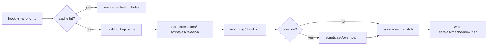

# Hooks

A **hook** is an event: `hook()` (or `u_hook_most_specific()`) builds lookup paths from primitives and sources matching `*.hook.sh` files.

| Piece | Role |
|-------|------|
| `-s` subject | Folder scope (`instance`, `test`, `log`, …) |
| `-a` action | Event name (`init`, `asc`, `registry_set`, …) |
| `-p` prefix | Exclusive phase (`pre`, `post`, …) → `pre_<action>.hook.sh` |
| `-v` variants | Globals whose values become dotted filename parts |
| `-e` extension | Limit to one extension namespace |
| `-c` custom ext | File extension other than `hook.sh` (e.g. `yml`) |
| `-t` | Dry-run: list matches, do not source |
| `-r` | Also search project root |

Default when `-v` omitted: `INSTANCE_TYPE`.



`u_hook_most_specific()` walks the same path list but sources **only the most specific** match (deepest path + most dots; project `scripts/` gets priority over generic extensions).

### Abstract actions (omit `-s`)

With **only** `-a` (no subject filter), lookup walks **all** subjects. Useful for generic defaults that any subject may override (e.g. transcription’s `u_hook_most_specific -a 'transcribe' …`).

## Lookup roots

- `asc/<subject>/…`
- `asc/extensions/<ext>/<subject>/…`
- `scripts/asc/extend/<subject>/…`

Override path: `scripts/asc/override/` (via `u_autoload_override`). Bootstrap timing: [bootstrap.md](bootstrap.md).

## Variant combinations

`-v 'A B C'` expands to **all unordered subsequences** of the current values of globals `A`, `B`, `C` (via `u_str_subsequences`), producing dotted lookup files:

```text
hook -a init -s instance -v 'HOST_TYPE INSTANCE_TYPE'
# HOST_TYPE=local INSTANCE_TYPE=dev → matches among:
#   …/init.hook.sh
#   …/init.local.hook.sh
#   …/init.local.dev.hook.sh
#   …/init.dev.hook.sh
```

`PROVISION_USING=compose` or `docker-compose` **dual-expands** to both tokens (`u_provision_using_lookup_values` in `asc/utilities/hook.sh`).

Debug:

```bash
make hook-debug s:instance a:start v:STACK_VERSION PROVISION_USING HOST_TYPE INSTANCE_TYPE
make hook-debug ms s:instance a:stop v:PROVISION_USING HOST_TYPE   # most-specific only
make hook s:instance a:start
```

Cache: `data/asc/cache/hook.*.sh` (clear with `make asc-cache-clear`).

SoT: `asc/utilities/hook.sh`, `asc/test/asc/hook.test.sh`.
