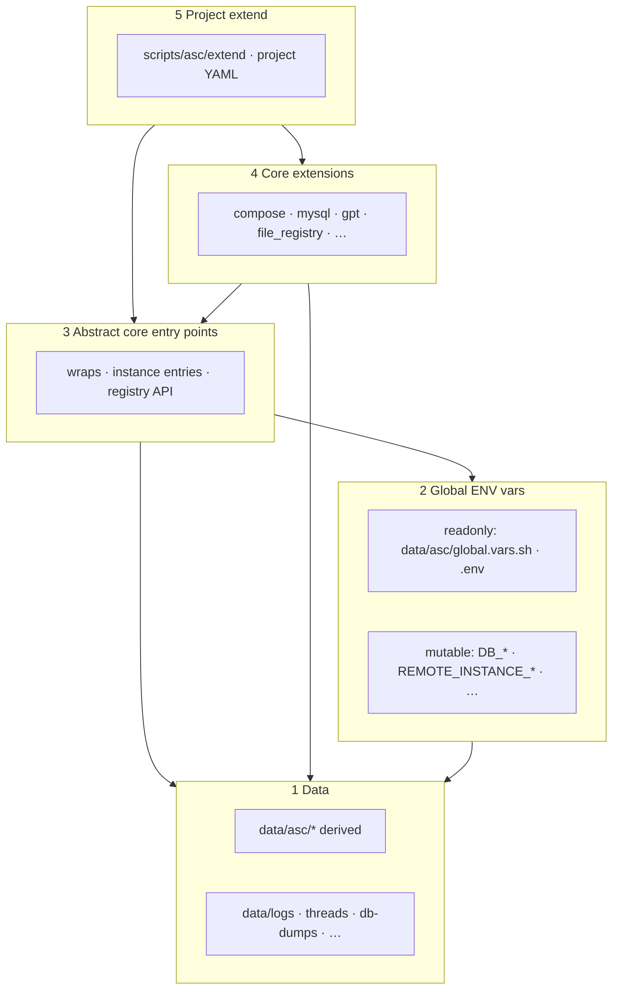
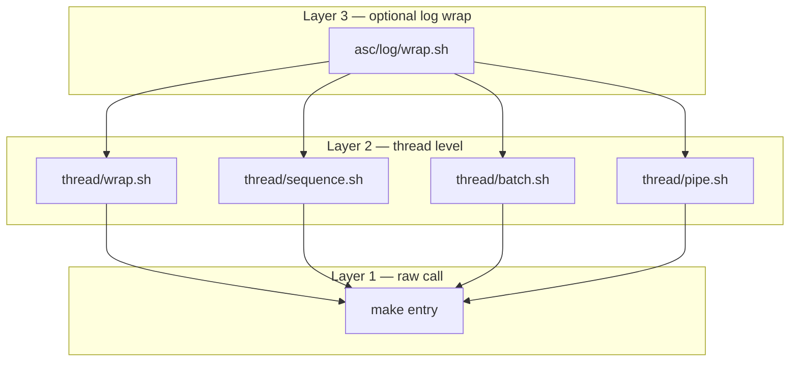

# ASC layers

Two related meanings of “layers” in ASC. Do not confuse them with the Docker **`compose`** extension (`asc/extensions/compose`).

1. **Implementation differentiators (1–5)** — where to put state, config, contracts, extensions, and project code.
2. **Launch stack (raw → thread → log wrap)** — how make entry points are stacked at runtime.

---

## Implementation differentiators (1–5)

Prefer the lowest layer that can own the concern.

| # | Layer | Owns / provides | Location | Explanation |
|---|-------|-----------------|----------|-------------|
| **1** | **Data** | On-disk / host facts (may be private or identifying): paths, entity YAML, logs, dumps | `data/…`, host files (e.g. `/etc/hosts`) | **State only** — never business logic |
| **2** | **Global ENV vars** | (A) **readonly globals** — aggregated on `make init` / `reinit`, written to gitignored `data/asc/global.vars.sh` + `.env`; (B) **calling-scope (“mutable”) vars** — ordinary shell vars that change mid-run (e.g. `DB_*` after `u_db_set`) | Declarations: `env.yml`, `.env-local.yml`, `asc/**/global.vars.sh`, `scripts/asc/extend/**/global.vars.sh` | **Configuration & execution context** |
| **3** | **Abstract ASC core entry points** | Abstract actions that are hooks (placeholders) or wrappers with **no** concrete backend | `asc/<changelog,log,loop,thread>/wrap.sh`, `asc/instance/<entry>.sh` | **Contracts** — calling-scope vars, hooks to implement |
| **4** | **ASC core extensions** | Broader abstract actions and/or **minimal** concrete implementations; often disabled by default | `asc/extensions/<name>` | Abstract e.g. `db`, `gpt`; concrete e.g. `compose`, `mysql`, `ollama` |
| **5** | **Project extend** | Project wiring, remotes, host policy | `scripts/asc/extend/**`, project YAML | **Overrides / product** — never dump this into core |



**Rules of thumb**

1. State on disk → **Layer 1**.
2. Instance config / mid-run retargeting → **Layer 2** (see [globals.md](globals.md)).
3. Contracts (wrap, get/set, token replace) → **Layer 3**.
4. Generic / minimal implementations → **Layer 4**.
5. This machine / product schedules, remotes policy → **Layer 5**.

See also [secrets.md](secrets.md) and [changelog-wrap.md](changelog-wrap.md).

---

## Launch stack (raw → thread → log wrap)

Every launch is a stack of at most three layers. Higher layers never invent a second operator — they only wrap the layer below.

| Layer | Role | Typical scripts |
|-------|------|-----------------|
| **1. Raw call** | Run one make entry (or shell) with no join / fan-out | `make <entry>`, script under `asc/` / `scripts/` |
| **2. Thread level** | Run one or more raw calls with a shell operator | `thread/wrap.sh` (`&`), `sequence.sh` (`&&` / `;`), `batch.sh` (`&` + wait), `pipe.sh` (`\|`) |
| **3. Optional log wrap** | Capture stdout/stderr + structured traces around layer 2 | `asc/log/wrap.sh` |



| Operator | Thread script | Unlogged aliases | + log wrap |
|----------|---------------|------------------|------------|
| `&` (+ wait for multi) | `asc/thread/batch.sh` | `parallel`, `thread-batch` | `lb`, `logged-batch` |
| `&&` or `;` | `asc/thread/sequence.sh` | `chain` (`instance/chain.sh`) | `lc` / `ls` |
| `\|` | `asc/thread/pipe.sh` | `pipe`, `thread-pipe` | `lp`, `logged-pipe` |
| `&` (single supervised) | `asc/thread/wrap.sh` | thread helpers | `lt`, `logged-thread` |

There is **no** `asc/chain/` folder. Plain `make chain` → `instance/chain.sh` → `thread/sequence.sh`.

Token prefixes for multi-entry runners: `e:<entry>`, `e:<N>:<entry>`, `a:<arg>`, `join:&&` / `join:;`, `workers:<N>`.

```bash
make lc e:site-cr e:site-composer a:install e:api-cr
# → make site-cr && make site-composer install && make api-cr
```

### Quick chooser

| Need | Use | Layers |
|------|-----|--------|
| Run once, foreground | `make <entry>` | 1 |
| One background job | `make lt e:…` | 3 → 2 → 1 |
| Ordered pipeline, no capture | `make chain` | 2 → 1 |
| Ordered + logs via chain | `make lc` | 3 → chain → sequence |
| Ordered + logs direct | `make ls` | 3 → sequence |
| Concurrent fan-out | `make parallel` / `lb` | 2 or 3 → batch |
| Stdout → stdin | `make pipe` / `lp` | 2 or 3 → pipe |
| Long-running / reboot | `make ll` | 3 → loop wrap → 1 |

Details and paths: [observability.md](observability.md).
